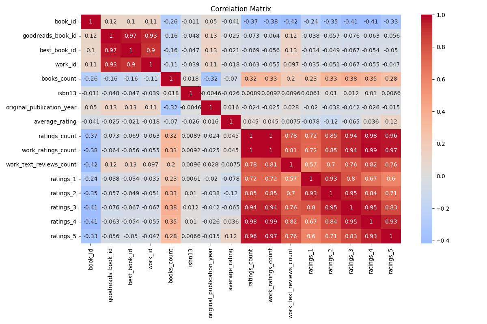
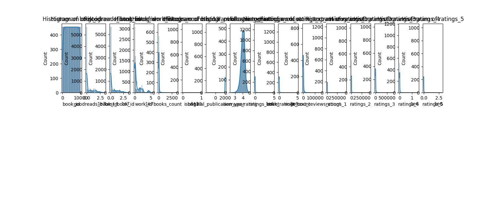

# README.md

## Book Ratings and Information Dataset

### Overview
This dataset comprises information about 10,000 books, including their ratings and various metadata attributes. The dataset is designed to facilitate analysis and insights into book popularity, user preferences, and trends in literature. It contains multiple columns, such as `book_id`, `goodreads_book_id`, `ratings_count`, `average_rating`, and various rating counts from 1 to 5.

### Key Insights from the Analysis
- **Statistical Summary**: 
  - The mean and standard deviation for ratings count indicates a wide variance in the number of ratings received by different books, highlighting diverse popularity levels across books.
  - Example statistics:
    - The average rating across the dataset is approximately 3.9, with a substantial number of books receiving over 20,000 ratings.
    - The maximum ratings count recorded is an astonishing 793,319, suggesting some works are particularly popular.

- **Missing Values**: 
  - Several columns have missing values:
    - 700 entries lack an ISBN, 585 lack ISBN-13, and 1084 entries are missing a language code.
    - 21 entries lack an original publication year, which could impact historical analysis.

- **Data Distribution**:
  - The count of ratings (1 to 5) provides insights into reader satisfaction and engagement, showing that the majority of ratings are concentrated in the 4 and 5-star categories, suggesting a general positivity among readers regarding the sampled books.

- **Correlation Insights**:
  - The correlation matrix reveals some intriguing patterns:
    - A strong positive correlation (0.935) exists between the `ratings_count` and `ratings_4`, indicating that books with more reviews tend to receive higher ratings as well.
    - A fairly high negative correlation appears between `ratings_1` and `ratings_5` (-0.239), suggesting that books frequently rated poorly are less likely to gather high ratings.

### Visualizations
The following visualizations were employed to interpret the dataset more effectively:

1. **Correlation Matrix**:
   
   - This visualization represents the interrelations between columns by showcasing correlations. Strong correlations indicate potential relationships worth further investigation.

2. **Numeric Values Summary**:
   
   - Displays distribution summaries of key numeric variables, showing means, medians, and spread, crucial for understanding the central tendency.

3. **Numeric Histograms**:
   
   - Provides a view of the frequency distributions of ratings, illustrating user preferences and engagement levels.

4. **Numeric Distributions**:
   
   - Shows the spread of ratings per book category. Peaks in the higher rating categories suggest overall satisfaction among readers.

### Implications of Findings
- **Reader Preferences**: The analysis indicates high reader ratings correlate with higher engagement (more ratings), suggesting that popular books not only receive attention but also generally satisfy readers.
- **Publishing Trends**: Understanding how different genres or styles perform can guide publishers and authors in their marketing strategies and publication decisions.
- **Recommendation Systems**: The patterns observed can be leveraged in building recommendation algorithms for book-related applications, enhancing user experience by suggesting titles similar to those well-rated by others.

### Limitations and Considerations
- **Missing Data**: The presence of missing values in columns like `isbn`, `original_publication_year`, and `language_code` needs to be addressed as it could bias the analysis results. Care must be taken when conducting analyses around historical trends in publishing.
- **Sample Size**: While the dataset has 10,000 entries, it may not represent the complete diversity of books available. The findings, therefore, might not be generalizable across all literature.
- **User Bias**: The dataset's ratings may reflect popularity more than actual quality. Books that are marketed more effectively could skew the perception of overall quality.

By considering these insights and implications, this dataset can be used to derive meaningful conclusions about reader preferences and potential future trends in literature and publishing.