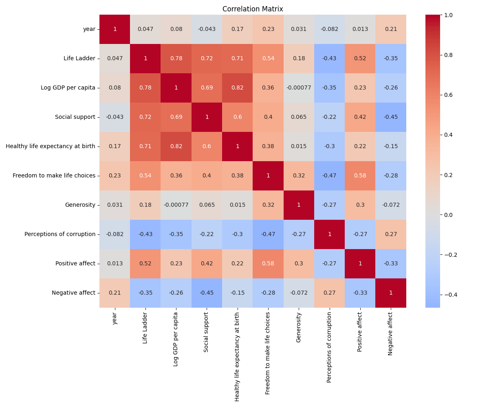

# README.md

## Dataset Overview 

This dataset provides a comprehensive analysis of various socio-economic and psychological factors that influence individuals' life satisfaction globally. The dataset spans from the year 2005 to 2023 and includes metrics that contribute to the concept of 'Life Ladder', which is essentially an indicator of subjective well-being.

### Key Features Include:
- **Country Name**: The name of the country.
- **Year**: The year of data collection.
- **Life Ladder**: A measure of subjective well-being (scale of 0-10).
- **Log GDP per capita**: The logarithm of the country's Gross Domestic Product per capita.
- **Social Support**: A measure of perceived support within the community.
- **Healthy Life Expectancy at Birth**: The average number of years a newborn is expected to live in full health.
- **Freedom to Make Life Choices**: A measure of individuals’ freedom to make choices in their lives.
- **Generosity**: A measure of charitable giving and social contributions.
- **Perceptions of Corruption**: A measure of the perceived level of corruption in governance.
- **Positive Affect**: The extent to which individuals feel positive emotions.
- **Negative Affect**: The extent to which individuals feel negative emotions.

## Key Insights from the Analysis

- **Correlational Insights**:
  - Strong positive correlation of **Life Ladder** with **Log GDP per capita** (0.784) and **Social support** (0.723).
  - A notable positive relationship between **Life Ladder** and **Freedom to make life choices** (0.538).
  - A moderate negative correlation between **Life Ladder** and **Perceptions of corruption** (-0.430).

- **Statistical Considerations**:
  - The mean **Life Ladder** score is **5.48**, indicating a moderate level of well-being across the dataset.
  - The dataset has some missing values: **28** for **Log GDP per capita**, **63** for **Healthy life expectancy at birth**, and **81** for **Generosity**.

- **Distributional Insights**:
  - The Life Ladder scores range from **1.281** to **8.019** demonstrating significant diversity in subjective well-being.
  - The **standard deviation for Life Ladder** (1.125) reveals fluctuations in well-being among different countries.

## Visualizations Used

1. **Correlation Matrix**:
   
   - The correlation matrix visually represents the relationship between various features. The brighter the color, the stronger the correlation. Notably, it indicates the tight relationship between **Life Ladder**, **Log GDP per capita**, and **Social support**.

2. **Numerical Values**:
   
   - This visualization depicts the summary statistics of crucial features, providing a quick glance at the mean, standard deviation, and quantiles.

3. **Numeric Histograms**:
   
   - These histograms present the distribution of key numeric features such as **Life Ladder** and **Log GDP per capita**, helping to assess skewness and potential outliers.

4. **Numeric Distributions**:
   
   - This visualization showcases the distribution of various attributes in the dataset, facilitating the understanding of data spread.

## Potential Implications of Findings

- **Policy Insights**: Policymakers can use this information to focus on improving socioeconomic factors that significantly correlate with well-being, such as human development and governance transparency.

- **Social Programs**
  - Developing community support systems may enhance social and psychological well-being.
  
- **Economic Strategies**: Initiatives that promote economic growth and reduce perceptions of corruption can potentially improve citizens' life satisfaction.

## Limitations and Considerations

1. **Missing Data**: The presence of missing values in certain attributes may impact the robustness of conclusions drawn from analyses. Consider utilizing imputation or alternative datasets for comprehensive insights.

2. **Causality**: The correlations observed do not imply causation. Additional exploratory or experimental research would be required to establish direct causal relationships.

3. **Changing Dynamics**: Socio-economic conditions can change rapidly, and thus, data from earlier years may become outdated. Continuous data collection and updates are essential to maintain relevance.

4. **Single Snapshot**: The dataset captures the perspectives of specific years; thus, it might not encompass trends or changes over time unless longitudinal analyses are performed.

## Conclusion 

This dataset serves as a valuable resource for exploring the interplay between economic indicators, societal support systems, and individual well-being across different countries. By understanding these relationships, stakeholders can devise effective strategies to improve quality of life globally. 

For further analyses, feel free to clone this repository and utilize the data with your own tools and insights!