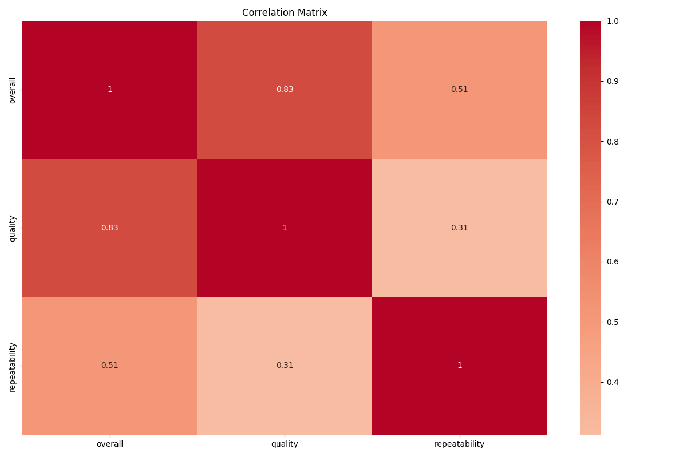
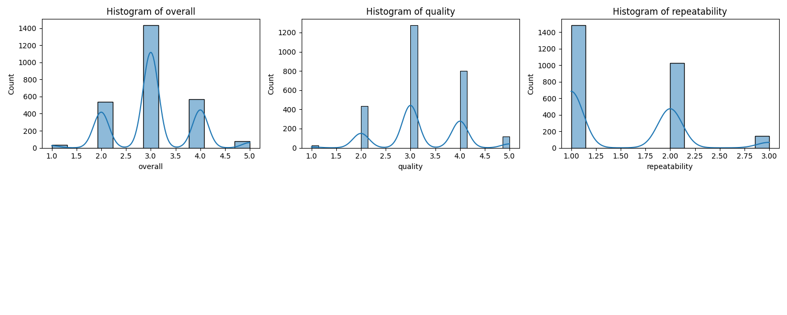

# README.md

## Dataset Overview

This dataset provides insights into various metrics related to a specific domain. The dataset includes a total of 2,652 entries, encompassing fields pertaining to overall ratings, quality assessments, and repeatability scores. Each observation appears to correspond to an instance assessed by users or evaluators, revealing key metrics that might inform product or service evaluations.

### Columns:

- **date**: The date of the observation (with 99 missing entries).
- **language**: Language of the observation.
- **type**: Type of the observation.
- **title**: Title related to the observation.
- **by**: The individual or entity who provided the observation (with 262 missing entries).
- **overall**: Overall rating (integer values ranging from 1 to 5).
- **quality**: Quality rating (integer values ranging from 1 to 5).
- **repeatability**: Repeatability score (integer values ranging from 1 to 3).

## Key Insights

1. **Overall Ratings**:
   - **Mean** rating is approximately **3.05**, suggesting a slightly above-average perception among users.
   - The **standard deviation** of **0.76** indicates variability in ratings, with several outliers potentially affecting perceptions.
   - The distribution shows the following quartiles: 
     - 25% of the ratings are **3 or below**,
     - 50% (median) is **3**,
     - 75% ratings are **3 or higher**.

2. **Quality Assessment**:
   - The **mean quality rating** is about **3.21**, slightly higher than the overall average.
   - A **strong correlation** of **0.826** with overall ratings suggests that quality significantly influences the overall perception.

3. **Repeatability**:
   - The average repeatability score is **1.49** (close to between 1 and 2) with a maximum of **3**.
   - This metric indicates how often observers would likely give similar ratings, with lower values suggesting higher variability in assessments.

4. **Correlation Insights**:
   - A strong correlation between overall ratings and quality (**0.826**) highlights that enhancing quality could lead to better overall ratings.
   - Moderate correlation exists between overall ratings and repeatability (**0.513**), indicating that repeatability may also play a role in overall perceptions but to a lesser extent.

5. **Missing Data Considerations**:
   - The **date** and **by** fields have missing values (99 and 262 entries respectively) that may require imputation or further investigation to ensure that analyses leveraging these fields are comprehensive.

## Visualizations

### Correlation Matrix

- The above matrix visually indicates relationships among overall ratings, quality, and repeatability. Strong correlations highlight where to focus improvement efforts.

### Numeric Value Distribution

- This visualization shows the distribution of overall ratings, quality assessments, and repeatability scores, illustrating how ratings cluster.

### Numeric Histograms

- Histograms provide a distribution view of each metric, revealing both the frequency of low and high ratings and indicating potential anomalies.

### Numeric Distributions

- These graphs reveal more informative insights into the concentration of specific values within the metrics.

## Practical Implications

- **Quality Improvement**: Given the correlation between quality and overall ratings, organizations can focus on enhancing quality to improve user satisfaction.
- **Targeted Efforts**: Data-driven insights allow stakeholders to direct their resources toward improving areas where repeatability and quality show the most substantial impact on ratings.
- **User Engagement**: Understanding patterns in repeatability can help shape user interaction strategies, making them more engaging and effective for users.

## Limitations and Considerations

- **Missing Values**: Data missing in critical columns such as date and by may skew analyses unless appropriately handled.
- **Contextual Factors**: Ratings may be influenced by external factors not captured in the dataset, such as market conditions or trends at the time of observation.
- **Interpreting Correlations**: While correlations suggest relationships, they do not imply causation and should be interpreted with caution. Additional analyses might be required for definitive conclusions.

This dataset offers valuable insights into user perceptions across various metrics, paving the path for data-driven strategies and deepening the understanding of quality as it relates to overall user satisfaction.